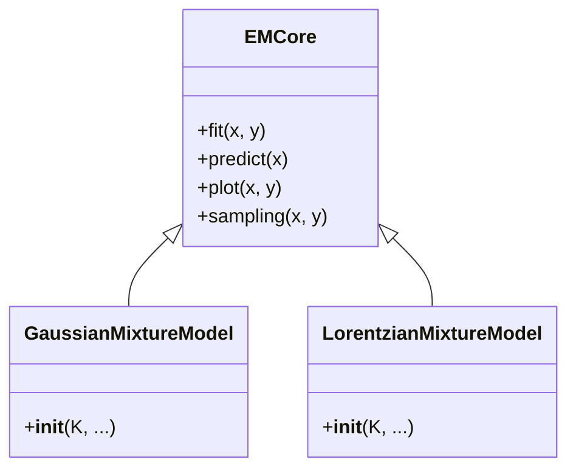

# API リファレンス

本パッケージの主要なクラスと関数について説明します。
多くのモデルクラスは `EMCore` クラスを継承しており、共通のインターフェースを持っています。

### クラス継承関係



## GaussianMixtureModel

ガウス分布混合モデルを扱うクラスです。

```python
from EMPeaks import GaussianMixture
gmm = GaussianMixture.GaussianMixtureModel(K=3, background='linear')
```

### 初期化 (`__init__`)

```python
GaussianMixtureModel(K=2, x_min=-300, x_max=300, sigma_min=0.1, sigma_max=50, background='none', k_ramp=5)
```

- **K** (int): ピークの数。
- **x_min**, **x_max** (float): 解析するX軸（エネルギーなど）の範囲。
- **background** (str): バックグラウンドモデルの種類。
    - `'none'`: バックグラウンドなし。
    - `'uniform'`: 一様分布。
    - `'linear'`: 線形（勾配あり）。
    - `'ramp_sum'`: Ramp-Sumモデル（階段状）。
- **sigma_min**, **sigma_max** (float): ガウス分布の幅（標準偏差）の制約範囲。

### 主要メソッド

#### `fit(x, intensity, method='adapted_em', ...)`

データに対してモデルをフィッティングします。

```mermaid
flowchart TD
    Start[開始] --> Init[初期値設定<br/>(sampling等)]
    Init --> LoopStart{収束ループ}
    LoopStart --> EStep[E-step: 所属確率の計算]
    EStep --> MStep[M-step: パラメータ更新]
    MStep --> CalcLL[尤度(Log-Likelihood)計算]
    CalcLL --> Check{収束判定<br/>(変化 < r_eps?)}
    Check -- No --> LoopStart
    Check -- Yes --> End[終了]
```

- **x** (array-like): X軸データ。
- **intensity** (array-like): Y軸データ（強度）。
- **method** (str): フィッティング手法。
    - `'adapted_em'`: Spectrum Adapted EMアルゴリズム（推奨）。
    - `'smart'`: サンプリング -> EM -> 最小二乗法 を組み合わせた高精度な手法。
    - `'leastsq'`: 最小二乗法。
- **trial** (int): `method='smart'` の場合の初期値サンプリング試行回数。

戻り値: フィッティング結果の情報を含む辞書（Log-Likelihood, RMSEなど）。

#### `predict(x)`

現在のモデルパラメータに基づいて、指定されたX座標での計算値（強度）を返します。

- **x** (array-like): 計算したいX座標。
- **戻り値**: 計算されたY値（numpy array）。

#### `plot(x_data, intensity)`

データとフィッティング結果をプロットして表示します。

- **x_data**: プロットするデータのX軸。
- **intensity**: プロットするデータのY軸。

#### `sampling(x, intensity, trial=10, ...)`

ランダムな初期値を用いて複数回フィッティングを行い、最も良い結果（尤度が高い、またはRMSEが低い）を採用します。局所解を避けるために有効です。

- **trial** (int): 試行回数。

## その他のモデル

以下のモデルも同様のインターフェースで使用可能です。

- **LorentzianMixtureModel**: ローレンツ分布混合モデル
- **PseudoVoigtMixtureModel**: 擬Voigt分布混合モデル
- **DoniachSunjicMixtureModel**: Doniach-Sunjic分布混合モデル

これらは `EMPeaks.LorentzianMixture` などのサブパッケージからインポートできます。
