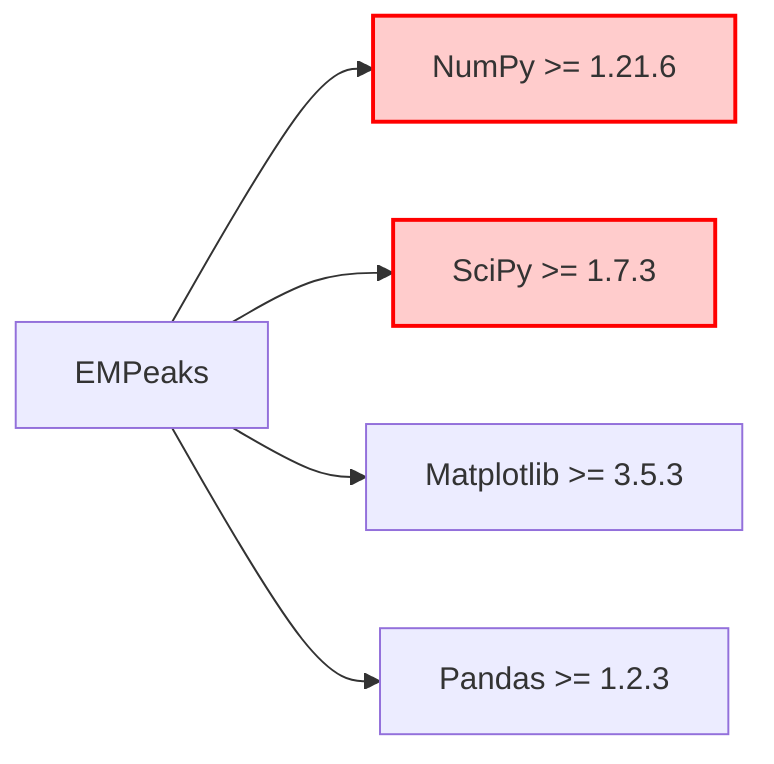
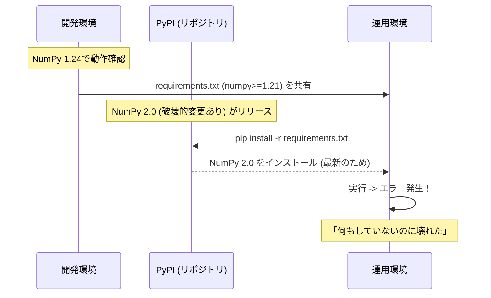

# 依存関係とリスク管理

本プロジェクトが依存しているライブラリと、それらに起因する潜在的なリスク（「何もしていないのに壊れた」を防ぐための情報）について記述します。

## 1. 主要な依存ライブラリ

`requirements.txt` および `setup.cfg` に基づく主要な依存関係は以下の通りです。

| ライブラリ | 指定バージョン | 役割 | リスク度 |
| :--- | :--- | :--- | :--- |
| **NumPy** | `>= 1.21.6` | 数値計算の基盤。配列操作など。 | **高** |
| **SciPy** | `>= 1.7.3` | 科学技術計算。最適化 (`optimize`) や積分 (`integrate`) で使用。 | **高** |
| **Matplotlib** | `>= 3.5.3` | グラフ描画。`plot` メソッドなどで使用。 | 中 |
| **Pandas** | `>= 1.2.3` | データ操作（現状のコードでは必須性は低いが指定あり）。 | 中 |

## 2. 潜在的なリスクと対策

### バージョン固定の欠如による破損
現在の `requirements.txt` では `>=` (以上) という指定のみが行われています。
これにより、**新しいメジャーバージョンがリリースされた際に、自動的に互換性のないバージョンがインストールされる** 可能性があります。

#### 具体的なリスク例
- **NumPy 2.0**: NumPyはメジャーバージョンアップで古いAPI（例えば `np.float` などの型エイリアス）を削除することがあります。これにより、コードが突然動かなくなる可能性があります。
- **SciPyの仕様変更**: `scipy.optimize` や `scipy.integrate` の関数の引数や戻り値の仕様が変更されることがあります。

### 対策推奨事項

1.  **バージョンの固定 (Pinning)**
    運用環境では、動作確認が取れているバージョンを厳密に指定することを推奨します。
    例: `numpy==1.24.3`

2.  **仮想環境の分離**
    開発や実行を行う際は、必ず `venv` や `conda` 等でプロジェクト専用の仮想環境を作成し、システム全体のPython環境（Global環境）の影響を受けないようにしてください。

3.  **定期的な依存関係の更新テスト**
    「何もしていないのに壊れる」を防ぐため、定期的に新しいバージョンのライブラリでテストを実行し、警告（DeprecationWarning）が出ていないか確認してください。

## 3. Pythonバージョン
`setup.cfg` により、**Python 3.8以上** が必須とされています。
古いPython環境（3.7以下）では動作しない、または依存ライブラリがインストールできない可能性があります。
