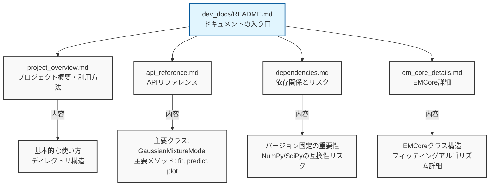

# ドキュメント構成マップ

現在の `dev_docs` 内のドキュメント構成と役割を可視化したものです。

```mermaid
graph TD
    Root[dev_docs/README.md<br/>ドキュメントの入り口] --> Overview
    Root --> API
    Root --> Deps
    Root --> EMCore

    Overview[project_overview.md<br/>プロジェクト概要・利用方法]
    Overview -->|内容| Usage[基本的な使い方<br/>ディレクトリ構造]

    API[api_reference.md<br/>APIリファレンス]
    API -->|内容| Funcs[主要クラス: GaussianMixtureModel<br/>主要メソッド: fit, predict, plot]

    Deps[dependencies.md<br/>依存関係とリスク]
    Deps -->|内容| Risks[バージョン固定の重要性<br/>NumPy/SciPyの互換性リスク]

    EMCore[em_core_details.md<br/>EMCore詳細]
    EMCore -->|内容| EMCoreContent[EMCoreクラス構造<br/>フィッティングアルゴリズム詳細]

    classDef default fill:#f9f9f9,stroke:#333,stroke-width:2px;
    classDef main fill:#e1f5fe,stroke:#01579b,stroke-width:2px;
    class Root main;
```
