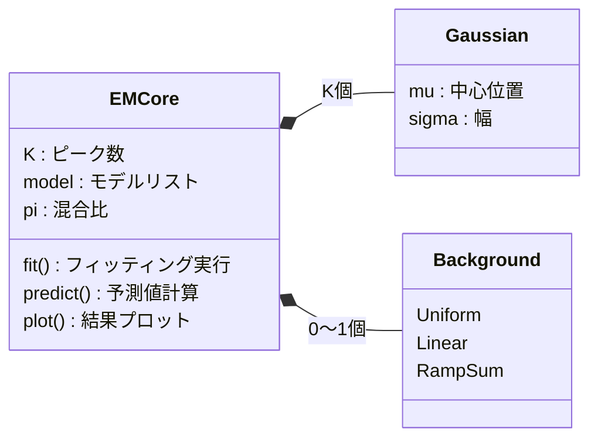
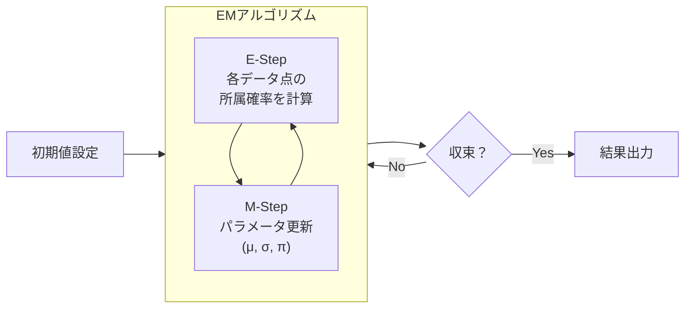

# EMCore 詳細ドキュメント

`EMCore` クラスは EMPeaks ライブラリの中核であり、EM（期待値最大化）アルゴリズムを用いたスペクトルのピークフィッティング機能を提供します。

---

## 🚀 クイックスタート

最も一般的な使い方を3ステップで紹介します。

```python
from EMPeaks.GaussianMixture import GaussianMixtureModel
import numpy as np

# ① データの準備
x = np.linspace(0, 100, 500)
y = ...  # スペクトルデータ

# ② モデル作成（ピーク数を指定）
model = GaussianMixtureModel(K=3, background='linear')

# ③ フィッティング実行
result = model.fit(x, y, method='smart')
model.plot(x, y)  # 結果を可視化
```

### 💡 どのメソッドを使えばいい？


> **おすすめ**: 迷ったら `method='smart'` を使ってください。初期値探索→EM→最小二乗法を自動で組み合わせ、高精度な結果を得られます。

---

## 📊 クラス概要



### 主な機能

| 機能 | 説明 |
|:---|:---|
| **モデル構築** | ガウスピーク（K個）+ 背景モデルの組み合わせ |
| **パラメータ推定** | EMアルゴリズムによる最尤推定 |
| **高度な手法** | サンプリング、決定論的アニーリング、最小二乗法 |
| **可視化** | Matplotlib によるプロット機能 |

---

## ⚙️ 初期化パラメータ

### `__init__()` のパラメータ一覧

| パラメータ | 型 | デフォルト | 説明 |
|:---|:---|:---|:---|
| `K` | int | 2 | ピークの数 |
| `x_min` | float | -300 | X軸の最小値 |
| `x_max` | float | 300 | X軸の最大値 |
| `sigma_min` | float | 0.1 | ピーク幅の下限 |
| `sigma_max` | float | 50 | ピーク幅の上限 |
| `background` | str | 'none' | 背景モデルの種類 |
| `k_ramp` | int | 5 | RampSum用のランプ数 |

### 背景モデルの種類

| 値 | 説明 | 使用場面 |
|:---|:---|:---|
| `'none'` | 背景なし | ベースラインが0のデータ |
| `'uniform'` | 一定値 | フラットなバックグラウンド |
| `'linear'` | 線形（傾き付き） | 傾斜したベースライン |
| `'ramp_sum'` | 階段状 | XPSなど複雑な背景 |

---

## 🔧 メソッド一覧

### フィッティング系（最重要）

#### `fit(x, intensity, method='adapted_em', ...)`

**メインのフィッティングメソッド**

| 引数 | 型 | 説明 |
|:---|:---|:---|
| `x` | array | X軸データ |
| `intensity` | array | Y軸データ（強度） |
| `method` | str | フィッティング手法（下表参照） |
| `max_iter` | int | 最大反復回数（デフォルト: 100） |
| `r_eps` | float | 収束判定の閾値（デフォルト: 1e-4） |
| `trial` | int | サンプリング試行回数（smartの場合） |

**method の種類**

| method | 速度 | 精度 | 説明 |
|:---|:---|:---|:---|
| `'adapted_em'` | ⚡高速 | 〇 | 基本のEMアルゴリズム |
| `'smart'` | 普通 | ◎ | サンプリング→EM→最小二乗法（**推奨**） |
| `'leastsq'` | 普通 | 〇 | 最小二乗法のみ |
| `'l2div'` | 普通 | 〇 | L2ダイバージェンス最小化 |

**使用例**

```python
# 基本的な使い方
result = model.fit(x, y, method='smart', trial=10)

# 結果の確認
print(f"RMSE: {result['RMSE']:.4f}")
print(f"ピーク位置: {result['mu']}")
```

---

#### `sampling(x, intensity, trial=10, ...)`

**複数の初期値で試行し、最良の結果を選択**

局所解を避けたい場合に有効です。

```python
# 20回試行して最良の結果を採用
result = model.sampling(x, y, trial=20)
```

---

### 予測・評価系

#### `predict(x)`

現在のパラメータでモデルの予測値を計算します。

```python
x_fine = np.linspace(x.min(), x.max(), 1000)
y_pred = model.predict(x_fine)
```

#### `log_likelihood(x, intensity)`

対数尤度を計算します（モデルの当てはまりの良さの指標）。

---

### 可視化系

#### `plot(x_data, intensity)`

フィッティング結果をプロットします。

```python
model.plot(x, y)  # 元データ + 各ピーク + 合計曲線を表示
```

---

### パラメータ管理系

| メソッド | 説明 |
|:---|:---|
| `set_param(**param)` | パラメータを外部から設定 |
| `export_param()` | 現在のパラメータを辞書で取得 |
| `init_param_uniform()` | パラメータをランダム初期化 |

**パラメータの取得例**

```python
params = model.export_param()
print(f"ピーク位置: {params['mu']}")
print(f"ピーク幅: {params['sigma']}")
print(f"混合比: {params['pi']}")
```

---

## 🔄 処理フロー

### EMアルゴリズムの流れ



### `method='smart'` の処理フロー


---

## 📝 実践的な使用例

### 例1: 基本的なピークフィッティング

```python
from EMPeaks.GaussianMixture import GaussianMixtureModel
import numpy as np

# サンプルデータ生成
x = np.linspace(0, 100, 500)
y = (50 * np.exp(-((x-30)**2)/(2*5**2)) + 
     80 * np.exp(-((x-60)**2)/(2*8**2)) + 
     np.random.normal(0, 2, len(x)))

# フィッティング
model = GaussianMixtureModel(K=2, x_min=0, x_max=100, background='uniform')
result = model.fit(x, y, method='smart', trial=10)

# 結果確認
print(f"ピーク1: 位置={result['mu'][0]:.2f}, 幅={result['sigma'][0]:.2f}")
print(f"ピーク2: 位置={result['mu'][1]:.2f}, 幅={result['sigma'][1]:.2f}")

model.plot(x, y)
```

### 例2: XPSスペクトル解析（背景あり）

```python
# XPSデータでは ramp_sum 背景がよく使われます
model = GaussianMixtureModel(
    K=4,  # 4つのピーク
    x_min=280, x_max=295,  # 結合エネルギー範囲
    background='ramp_sum',
    k_ramp=10
)

result = model.fit(x_xps, y_xps, method='smart', trial=20)
```

### 例3: パラメータの初期値を指定

```python
model = GaussianMixtureModel(K=2)

# 既知の初期値を設定
model.set_param(
    mu=[30, 60],      # ピーク位置の初期推定
    sigma=[5, 8],     # ピーク幅の初期推定
    pi=[0.4, 0.6]     # 混合比
)

# その初期値からフィッティング開始
result = model.fit(x, y, method='adapted_em')
```

---

## ⚠️ 注意点とTips

> **💡 ピーク数Kの選び方**
> 
> Kが大き過ぎると過学習、小さ過ぎるとフィットが悪くなります。
> 複数のKで試して、RMSEやBICを比較するのがベストです。

> **💡 収束しない場合**
> 
> - `max_iter` を増やす（デフォルト100→500など）
> - `method='smart'` で `trial` を増やす
> - 初期値を `set_param()` で手動設定

> **💡 計算が遅い場合**
> 
> - データ点数を減らす（ダウンサンプリング）
> - `trial` を減らす
> - `method='adapted_em'` を使用
