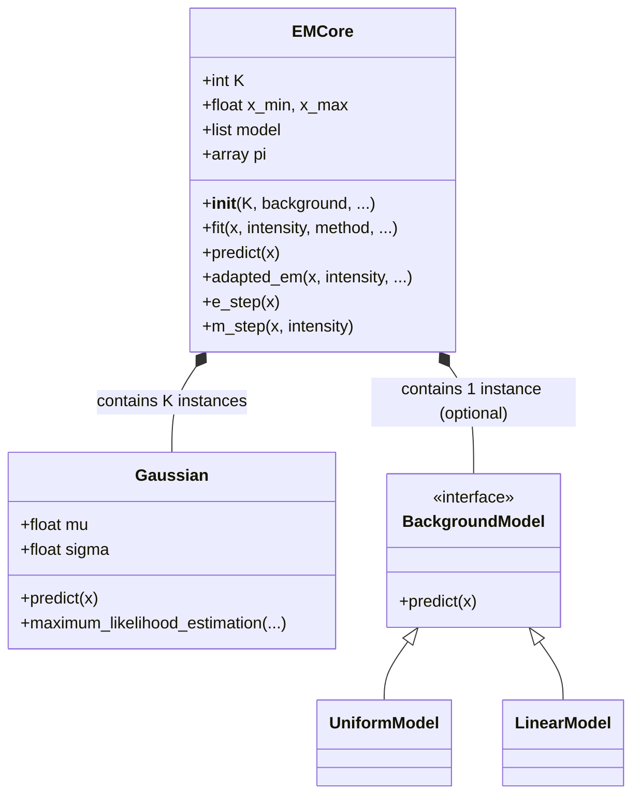

# EMCore 詳細ドキュメント

`EMPeaks/EMCore/_em_core.py` に定義されている `EMCore` クラスは、EMPeaks ライブラリの中核をなすクラスであり、混合ガウスモデル（Gaussian Mixture Model, GMM）を用いたピークフィッティング機能を提供します。

このドキュメントでは、`EMCore` クラスの全メソッドについて詳細に解説します。

## クラス概要

`EMCore` クラスは、観測データ（スペクトルなど）に対して、複数のガウス関数と背景モデルを組み合わせたモデルを適合（フィッティング）させるための機能を持っています。

### 主な機能

*   **モデル構築**: 任意の数（`K`）のガウスピークと、様々な種類の背景モデル（Uniform, Linear, SquareRoot, RampSum）を組み合わせることができます。
*   **パラメータ推定**: 最尤推定法（Maximum Likelihood Estimation）に基づき、EMアルゴリズム（Expectation-Maximization Algorithm）を用いてモデルパラメータを最適化します。
*   **フィッティング手法**: 通常の EM アルゴリズムに加え、決定論的アニーリング（Deterministic Annealing）や、初期値をランダムに変えて複数回試行するサンプリング機能、最小二乗法（Least Squares）との組み合わせなど、高度なフィッティング手法をサポートしています。
*   **可視化**: フィッティング結果を可視化するプロット機能を提供します。

## メソッド詳細リファレンス

### 初期化・設定関連

#### `__init__(self, K=2, x_min=-300, x_max=300, sigma_min=0.1, sigma_max=50, background='none', k_ramp=5)`
クラスのコンストラクタです。
- **引数**:
  - `K`: ガウスピークの数。
  - `x_min`, `x_max`: 定義域の範囲。
  - `sigma_min`, `sigma_max`: ガウス関数の標準偏差（幅）の制約範囲。
  - `background`: 背景モデルの種類（'none', 'uniform', 'squareroot', 'linear', 'ramp_sum'）。
  - `k_ramp`: `background='ramp_sum'` の場合のランプ関数の数。
- **機能**: 指定された設定でモデル（ガウス関数リストと背景モデル）を初期化します。混合比 `pi` も初期化されます。

#### `set_param(self, **param)`
モデルのパラメータを外部から設定します。
- **引数**: 任意のキーワード引数（`K`, `N`, `pi`, `mu`, `sigma` など）。
- **機能**: 渡された辞書に基づいて、モデルの内部パラメータを更新します。`K` が変更された場合はモデル構造の再構築も行われる可能性があります。

#### `set_param_background(self, **param)`
背景モデルに関するパラメータを設定・更新します。
- **引数**: 任意のキーワード引数。
- **機能**: `background` 属性に基づいて、適切な背景モデル（Uniform, Linear など）を `self.model` リストに追加または再設定します。

#### `extract_single_params(self, param_set, **param)`
個々のガウスモデル用のパラメータを抽出します。
- **引数**:
  - `param_set`: 抽出したいパラメータ名のセット（例: `{"mu", "sigma"}`）。
  - `**param`: パラメータを含む辞書。
- **機能**: 入力されたパラメータリストから、各ガウスモデルに対応する値を切り出して辞書リスト形式で返します。

#### `set_single_params(self, **param)`
個々のガウスモデルにパラメータを設定します。
- **引数**: 任意のキーワード引数。
- **機能**: `extract_single_params` を使用してパラメータを整理し、各 `Gaussian` インスタンスの `set_param` メソッドを呼び出して値を設定します。

#### `init_param_uniform(self)`
パラメータをランダムに初期化します。
- **機能**: 混合比 `pi` をランダムに設定し、各モデルの `init_model` を呼び出して初期化します。サンプリング手法などで使用されます。

### パラメータ出力関連

#### `export_param(self)`
現在のモデルパラメータを辞書形式で出力します。
- **戻り値**: パラメータを含む辞書（`mu`, `sigma`, `pi`, `N` など）。
- **機能**: 現在の内部状態をまとめて取得するために使用します。ガウスモデルは `mu` の値でソートされて出力されます。

#### `export_single_params(self, _tmp_param)`
個々のガウスモデルのパラメータを収集し、ソートします。
- **引数**: パラメータを格納する一時辞書。
- **機能**: 各 `Gaussian` インスタンスから `mu`, `sigma` を取得し、`mu` の昇順に並べ替えて辞書に格納します。

#### `print_param_summary(self, param)`
パラメータの要約を標準出力に表示します。
- **引数**: パラメータ辞書。
- **機能**: `mu`, `sigma`, `N`, `pi` などの主要な値を整形してコンソールに表示します。

### フィッティング・推定関連

#### `fit(self, x, intensity, method='adapted_em', ...)`
フィッティング処理のメインエントリポイントです。
- **引数**:
  - `x`, `intensity`: データ。
  - `method`: 手法（'adapted_em', 'smart', 'leastsq', 'l2div'）。
  - その他: `max_iter`, `r_eps`, `trial` など。
- **機能**: 指定された `method` に応じて、適切なフィッティングメソッド（`adapted_em`, `leastsq` など）を呼び出します。

#### `adapted_em(self, x, intensity, max_iter, r_eps, stdout)`
適応的 EM アルゴリズムを実行します。
- **機能**: E ステップと M ステップを交互に繰り返し、対数尤度が収束するまでパラメータを更新します。収束判定には相対残差 `residual` を使用します。

#### `e_step(self, x)`
EM アルゴリズムの E (Expectation) ステップです。
- **機能**: 負担率（各データ点が各モデル成分に属する確率）`_gamma` を計算します。

#### `m_step(self, x, intensity)`
EM アルゴリズムの M (Maximization) ステップです。
- **機能**: E ステップで求めた `_gamma` を重みとして、各モデル成分のパラメータ（`mu`, `sigma`）と混合比 `pi` を更新（最尤推定）します。

#### `sampling(self, x, intensity, ...)`
初期値を変えて複数回フィッティングを行うサンプリング手法です。
- **機能**: `trial` 回数分、ランダムな初期値から `fit` を実行し、最も良い結果（尤度最大または RMSE 最小）を返します。局所解回避に有効です。

#### `deterministic_annealing(self, x, intensity, ...)`
決定論的アニーリング法によるフィッティングです。
- **機能**: 温度パラメータを徐々に下げながらフィッティングを行うことで、大域的最適解を探索します。

#### `leastsq_for_normalization_factor(self, x, intensity, stdout)`
全体の強度スケール（正規化係数 `N_tot`）を最小二乗法で最適化します。
- **機能**: EM アルゴリズムの後に実行され、スペクトル全体の強度合わせを行います。

#### `l2_div(self, x, intensity, stdout)`
L2 ダイバージェンス最小化に基づくフィッティングを行います。
- **機能**: 尤度最大化ではなく、モデルとデータの L2 距離（二乗誤差）を最小化するようにパラメータを最適化します。`scipy.optimize.least_squares` を使用します。

### 予測・評価・可視化

#### `predict(self, x)`
現在のモデルによる予測値を計算します。
- **引数**: x 座標の配列。
- **戻り値**: 予測された強度（配列）。
- **機能**: 全てのモデル成分（ガウスピーク + 背景）の値を加重和して返します。

#### `log_likelihood(self, x, intensity)`
対数尤度を計算します。
- **機能**: 現在のモデルがデータをどれくらいよく説明できているかを示す指標（対数尤度）を計算します。

#### `plot(self, x_data, intensity)`
結果をプロットします。
- **機能**: 元データと、フィッティングされた各成分（各ガウスピーク、背景）、および全モデルの曲線を Matplotlib でグラフ描画します。

#### `add_hist_model(self, info, hist_model, trial)`
サンプリング履歴を情報辞書に追加します。
- **機能**: 複数回試行した際の各回のパラメータ（`mu`, `sigma`）を履歴として保存します。

## クラス図と処理フロー

以下に `EMCore` のクラス構造とフィッティングプロセスの概要を Mermaid 図で示します。



```mermaid
flowchart TD
    A[Start Fit] --> B{Method?}
    B -- adapted_em --> C[Initialize Parameters]
    C --> D[E-Step: Calculate Gamma]
    D --> E[M-Step: Update Parameters]
    E --> F{Converged?}
    F -- No --> D
    F -- Yes --> G[Finalize & Return Result]
    
    B -- smart --> H[Sampling (Multiple Trials)]
    H --> I[Select Best Initial Param]
    I --> J[High Precision EM]
    J --> K[Least Squares Refinement]
    K --> G
```

## 使用例

```python
from EMPeaks.EMCore._em_core import EMCore
import numpy as np

# データの準備 (例)
x = np.linspace(-10, 10, 100)
y = ... # 観測データ

# モデルの初期化 (2つのピーク + 一様背景)
em = EMCore(K=2, x_min=-10, x_max=10, background='uniform')

# フィッティング実行
result = em.fit(x, y, method='smart', trial=5)

# 結果の表示
print(result)
em.plot(x, y)
```
