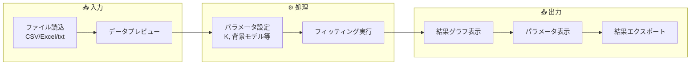
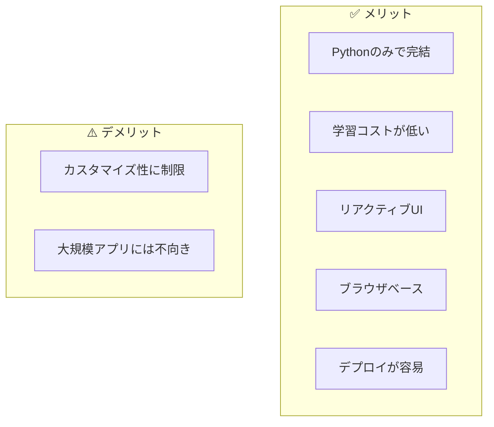
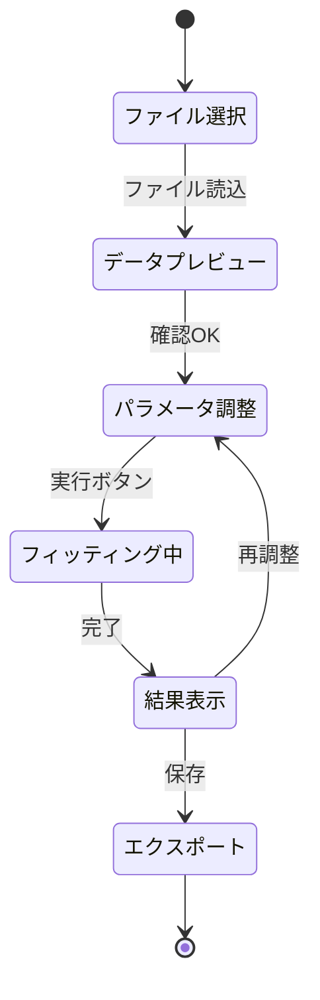
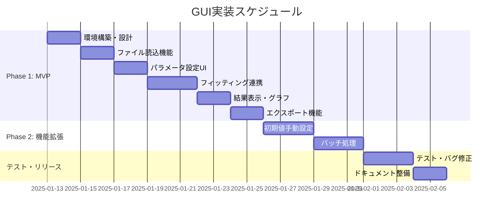

# GUI アプリケーション実装計画書

**作成日**: 2025-12-19  
**ステータス**: 計画中  
**目的**: EMPeaks のピークフィッティング機能をGUIで操作可能にする

---

## 📋 概要

EMPeaks ライブラリの機能を、コーディング不要で利用できるGUIアプリケーションを開発します。

### 想定ユーザー

- 研究者・分析担当者（Pythonに不慣れな方も含む）
- スペクトルデータの日常的な解析作業を行う方
- 結果の可視化と共有を重視する方

---

## 🎯 機能要件

### 必須機能（MVP）



| 機能 | 説明 | 優先度 |
|:---|:---|:---:|
| ファイル読込 | CSV, Excel, テキストファイルの読み込み | 🔴 必須 |
| データプレビュー | 読み込んだデータのグラフ表示 | 🔴 必須 |
| パラメータ設定 | ピーク数(K)、背景モデル、範囲指定 | 🔴 必須 |
| フィッティング実行 | ワンクリックでfit実行 | 🔴 必須 |
| 結果グラフ表示 | フィッティング結果の可視化 | 🔴 必須 |
| パラメータ表示 | μ, σ, 混合比の表形式表示 | 🔴 必須 |
| 結果エクスポート | CSV/画像での保存 | 🔴 必須 |

### 追加機能（Phase 2）

| 機能 | 説明 | 優先度 |
|:---|:---|:---:|
| 初期値の手動設定 | スライダーでμ, σを調整 | 🟡 中 |
| バッチ処理 | 複数ファイルの一括解析 | 🟡 中 |
| 解析履歴 | 過去の解析結果の保存・読込 | 🟡 中 |
| レポート生成 | PDF形式でのレポート出力 | 🟢 低 |

---

## 🛠️ 技術選定

### 推奨: Streamlit



**選定理由**:

1. **既存コードとの親和性**: EMPeaksはPythonパッケージのため、Pythonベースのフレームワークが最適
2. **marimoとの比較**: より多機能なUIコンポーネントが利用可能
3. **デプロイの容易さ**: Streamlit Cloudで無料ホスティング可能
4. **メンテナンス性**: チームメンバーがPythonに慣れている

### 比較表

| フレームワーク | 言語 | 学習コスト | カスタマイズ性 | デプロイ | 推奨度 |
|:---|:---|:---:|:---:|:---:|:---:|
| **Streamlit** | Python | ◎ 低 | ○ 中 | ◎ 容易 | ⭐⭐⭐ |
| Gradio | Python | ◎ 低 | △ 低 | ◎ 容易 | ⭐⭐ |
| marimo | Python | ◎ 低 | ○ 中 | △ 中 | ⭐⭐ |
| PyQt/PySide | Python | △ 高 | ◎ 高 | △ 中 | ⭐ |
| Electron | JS/TS | △ 高 | ◎ 高 | △ 中 | ⭐ |

---

## 📐 UI設計

### 画面レイアウト

```
┌─────────────────────────────────────────────────────────────┐
│  EMPeaks GUI                                    [Settings]  │
├─────────────────────────────────────────────────────────────┤
│                                                             │
│  ┌─────────────────┐  ┌─────────────────────────────────┐  │
│  │                 │  │                                 │  │
│  │  📁 ファイル選択  │  │                                 │  │
│  │                 │  │         📊 グラフ表示エリア        │  │
│  ├─────────────────┤  │                                 │  │
│  │                 │  │                                 │  │
│  │  ⚙️ パラメータ   │  │                                 │  │
│  │  ・ピーク数 K    │  └─────────────────────────────────┘  │
│  │  ・背景モデル    │                                      │
│  │  ・X軸範囲      │  ┌─────────────────────────────────┐  │
│  │  ・手法選択     │  │                                 │  │
│  ├─────────────────┤  │         📋 結果テーブル           │  │
│  │                 │  │   Peak  |  μ   |  σ   |  比率   │  │
│  │  [▶ 実行]       │  │   1     | 30.2 | 5.1  | 0.45   │  │
│  │  [💾 保存]      │  │   2     | 60.8 | 8.3  | 0.55   │  │
│  │                 │  │                                 │  │
│  └─────────────────┘  └─────────────────────────────────┘  │
│                                                             │
└─────────────────────────────────────────────────────────────┘
```

### 操作フロー



---

## 📁 ディレクトリ構成案

```
EMPeaks/
├── EMPeaks/              # 既存のパッケージ
├── gui/                  # 新規: GUIアプリケーション
│   ├── __init__.py
│   ├── app.py            # メインアプリ（Streamlit）
│   ├── components/       # UIコンポーネント
│   │   ├── __init__.py
│   │   ├── file_upload.py
│   │   ├── parameter_panel.py
│   │   ├── plot_area.py
│   │   └── result_table.py
│   ├── utils/            # ユーティリティ
│   │   ├── __init__.py
│   │   ├── data_loader.py
│   │   └── export.py
│   └── assets/           # 静的ファイル
│       └── style.css
├── empeaks_demo.py       # 既存: marimoデモ
└── requirements-gui.txt  # GUI用依存関係
```

---

## 💻 実装サンプル

### app.py（メインアプリ）

```python
import streamlit as st
import numpy as np
import pandas as pd
from EMPeaks.GaussianMixture import GaussianMixtureModel

st.set_page_config(
    page_title="EMPeaks GUI",
    page_icon="📊",
    layout="wide"
)

st.title("📊 EMPeaks - Peak Fitting GUI")

# サイドバー: パラメータ設定
with st.sidebar:
    st.header("⚙️ パラメータ設定")
    
    uploaded_file = st.file_uploader(
        "📁 データファイルを選択", 
        type=['csv', 'xlsx', 'txt']
    )
    
    K = st.slider("ピーク数 (K)", 1, 10, 2)
    
    background = st.selectbox(
        "背景モデル",
        ['none', 'uniform', 'linear', 'ramp_sum']
    )
    
    method = st.selectbox(
        "フィッティング手法",
        ['smart', 'adapted_em', 'leastsq']
    )
    
    run_button = st.button("▶️ フィッティング実行", type="primary")

# メインエリア
col1, col2 = st.columns([2, 1])

with col1:
    st.subheader("📈 グラフ")
    # プロット表示エリア
    if uploaded_file is not None:
        data = pd.read_csv(uploaded_file)
        st.line_chart(data)

with col2:
    st.subheader("📋 結果")
    # 結果テーブル表示エリア
    if 'result' in st.session_state:
        st.dataframe(st.session_state.result)
```

---

## 📅 実装スケジュール



---

## ⚠️ リスクと対策

| リスク | 影響度 | 対策 |
|:---|:---:|:---|
| 大容量ファイルでの性能低下 | 高 | データのサンプリング・キャッシュ機能の実装 |
| ブラウザ互換性問題 | 中 | Chrome/Firefox/Edgeでのテスト |
| 既存APIとの不整合 | 中 | EMPeaksのAPIを変更しない方針で設計 |

---

## ✅ 成功基準

- [ ] CSVファイルを読み込んでフィッティングを実行できる
- [ ] 結果をグラフと表で表示できる
- [ ] 結果をCSV/JSONでエクスポートできる
- [ ] ローカル環境で `streamlit run gui/app.py` で起動できる
- [ ] ドキュメント（README）が整備されている

---

## 🚀 起動方法（想定）

```bash
# 依存関係のインストール
pip install -r requirements-gui.txt

# GUIアプリの起動
streamlit run gui/app.py
```

ブラウザで `http://localhost:8501` にアクセスしてGUIを操作できます。
