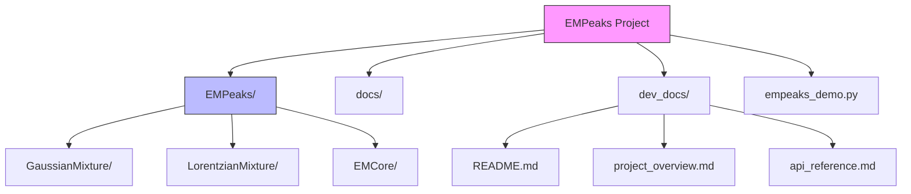
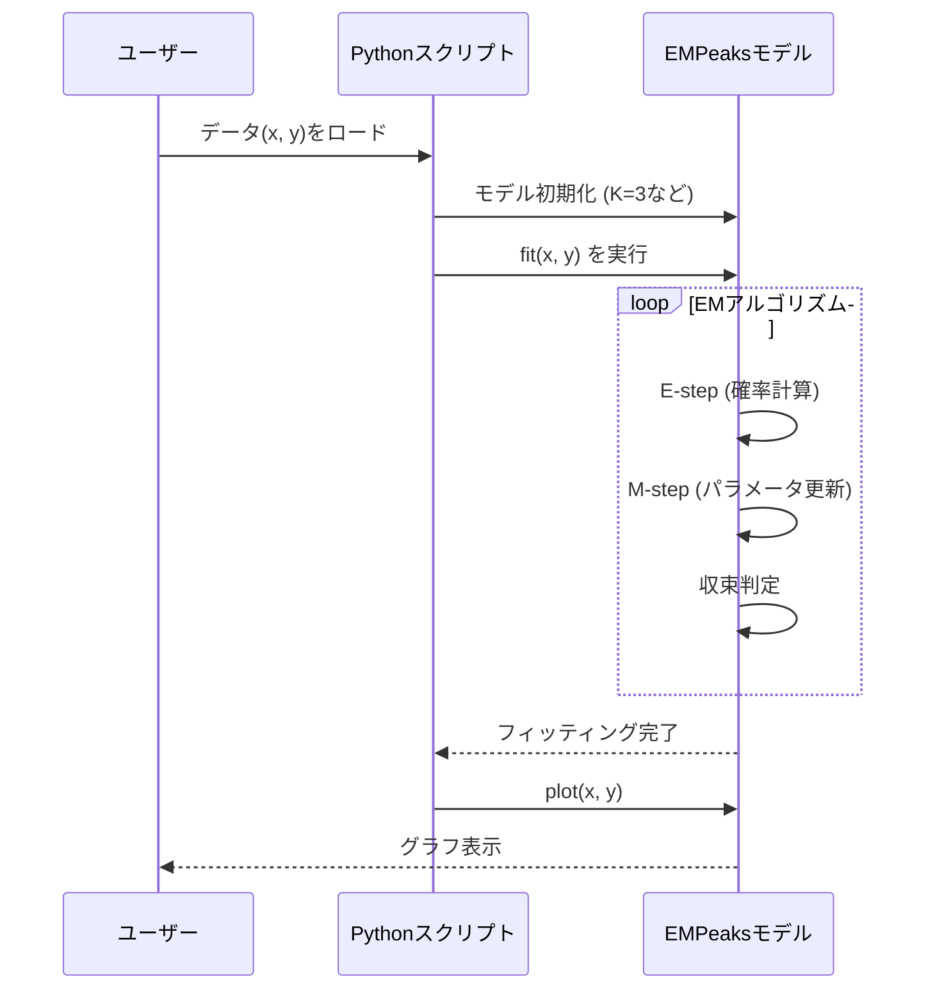

# プロジェクト概要と利用方法

## 1. 概要 (Overview)
**EMPeaks** は、Spectrum Adapted EM (Expectation-Maximization) アルゴリズムを使用した高スループットなピーク解析パッケージです。
主にスペクトルデータ（XPSなど）のピーク分離やフィッティングに使用されます。

主な機能:
- **Gaussian Mixture Model (GMM)**: ガウス分布混合モデルによるフィッティング
- **Lorentzian Mixture Model (LMM)**: ローレンツ分布混合モデル
- **Background Subtraction**: バックグラウンド除去機能 (uniform, linear, ramp_sum)

## 2. ディレクトリ構造 (Directory Structure)



主なディレクトリとファイルの役割は以下の通りです。

- **`EMPeaks/`**: パッケージのソースコード本体。
    - `GaussianMixture.py`: ガウス混合モデルの実装。
    - `LorentzianMixture.py`: ローレンツ混合モデルの実装。
    - その他のモデルやユーティリティが含まれます。
- **`docs/`**: ドキュメントやチュートリアル（Jupyter Notebook形式）。
- **`dev_docs/`**: 開発者および運用補助のためのドキュメント（本ディレクトリ）。
- **`empeaks_demo.py`**: `marimo` を使用したインタラクティブなデモアプリケーション。
- **`requirements.txt`**: 依存ライブラリ一覧。
- **`setup.cfg` / `pyproject.toml`**: パッケージのビルド設定。

## 3. 利用方法 (Usage)

### 解析フロー
典型的な解析の流れは以下の通りです。



### インストール
必要なライブラリをインストールします。
```bash
pip install -r requirements.txt
```

### 基本的な使い方
Pythonスクリプト内で `EMPeaks` パッケージをインポートして使用します。

```python
from EMPeaks import GaussianMixture
import numpy as np

# データの準備
x = ...
y = ...

# モデルの作成とフィッティング
gmm = GaussianMixture.GaussianMixtureModel(K=3) # Kはピーク数
gmm.fit(x, y)

# 結果のプロットなど
gmm.plot(x, y)
```

### デモの実行
`marimo` を使用したデモを実行することで、ブラウザ上でインタラクティブに動作確認ができます。

```bash
marimo run empeaks_demo.py
```
または、編集モードで起動する場合:
```bash
marimo edit empeaks_demo.py
```

## 4. 参考文献
本パッケージのアルゴリズム詳細については、以下の論文を参照してください。
- Sci. Tech. Adv. Mater. 20, 733-735 (2019)
- Sci. Tech. Adv. Mater. method 1, 45 (2021)
