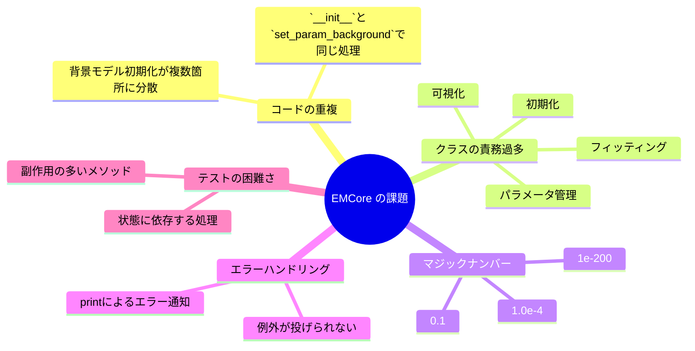
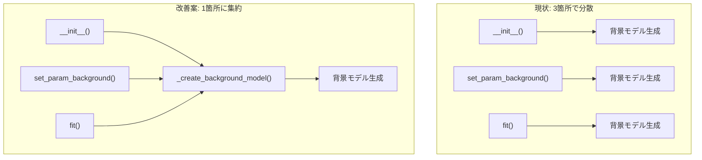
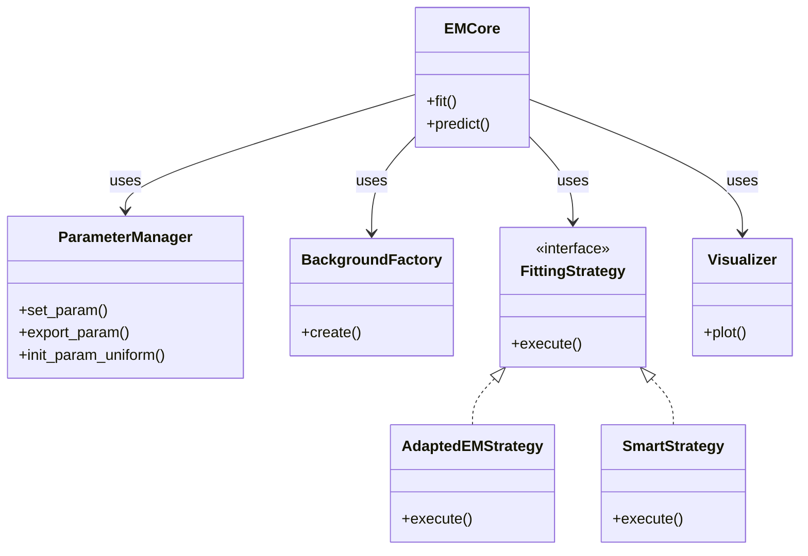
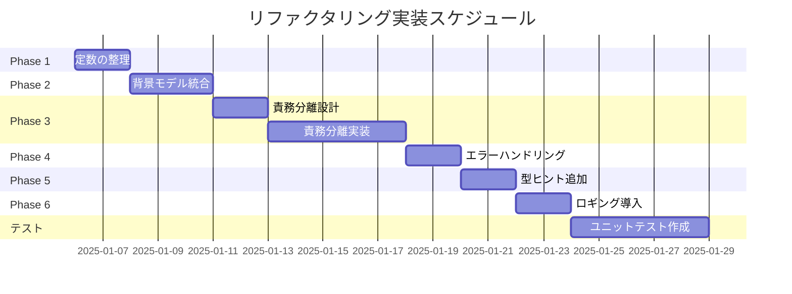

# EMCore リファクタリング計画書

**作成日**: 2025-12-18  
**対象ファイル**: `EMPeaks/EMCore/_em_core.py`  
**現在の行数**: 681行

---

## 📋 概要

本ドキュメントは `EMCore` クラスのリファクタリング計画を記述したものです。コードの保守性、可読性、テスタビリティの向上を目的とします。

### 🚀 実装進捗状況（2025-02-08 更新）

| Phase | 内容 | 状態 | 備考 |
|:---:|:---|:---:|:---|
| 1 | 定数の整理 | ✅ 完了 | 5つのクラス定数を追加 |
| 2 | 背景モデル初期化の統合 | ✅ 完了 | `_create_background_model()` 等を追加 |
| 3 | 責務の分離 | ✅ 完了 | `BackgroundFactory`, `Visualizer`, `FittingEngine` 作成 |
| 4 | エラーハンドリング改善 | ✅ 完了 | `exceptions.py` 追加 |
| 5 | 型ヒントの追加 | ✅ 完了 | `typing` インポート追加 |
| 6 | ロギングの導入 | ✅ 完了 | `logging` モジュール導入 |

### 現状の課題



---

## 🎯 リファクタリング目標

| 優先度 | 項目 | 効果 |
|:---:|:---|:---|
| 🔴 高 | 背景モデル初期化の統合 | コード重複削減、バグ防止 |
| 🔴 高 | 定数の命名・整理 | 可読性向上、意図の明確化 |
| 🟡 中 | 責務の分離 | 保守性向上、テスタビリティ向上 |
| 🟡 中 | エラーハンドリング改善 | デバッグ容易化 |
| 🟢 低 | 型ヒントの追加 | IDE補完、ドキュメント効果 |
| 🟢 低 | ログ機能の導入 | 本番運用対応 |

---

## 🔧 リファクタリング詳細

### Phase 1: 定数の整理（低リスク）✅ 完了

**現状の問題**

```python
# 散在するマジックナンバー
self.pi = np.append(self.pi, 1.0e-4)  # 行33, 38, 43
eps = 1e-20                            # 行479
self.log_likelihood(...) + 1e-200      # 行224
```

**改善案**

```python
class EMCore:
    # クラス定数として定義
    INITIAL_BACKGROUND_WEIGHT = 1.0e-4
    EPSILON_PREDICT = 1e-20
    EPSILON_LOG = 1e-200
    DEFAULT_MAX_ITER = 3000
    DEFAULT_R_EPS = 1e-9
```

**対象箇所**

| 行番号 | 現在の値 | 提案する定数名 |
|:---:|:---|:---|
| 33, 38, 43 | `1.0e-4` | `INITIAL_BACKGROUND_WEIGHT` |
| 224 | `1e-200` | `EPSILON_LOG` |
| 479 | `1e-20` | `EPSILON_PREDICT` |
| 226 | `3000` | `DEFAULT_MAX_ITER` |
| 226 | `1e-9` | `DEFAULT_R_EPS` |

---

### Phase 2: 背景モデル初期化の統合（中リスク）✅ 完了

**現状の問題**

背景モデルの初期化が3箇所に分散している：

1. `__init__()` (行29-67)
2. `set_param_background()` (行116-153)
3. `fit()` (行232-242)



**改善案: ファクトリメソッドの導入**

```python
def _create_background_model(self, background_type: str) -> list:
    """背景モデルを生成するファクトリメソッド"""
    if background_type == 'none':
        return []
    elif background_type == 'uniform':
        return [UniformModel(self.x_min, self.x_max)]
    elif background_type == 'squareroot':
        return [SquareRootModel(self.x_min, self.x_max)]
    elif background_type == 'linear':
        return [LinearModel(self.x_min, self.x_max)]
    elif background_type == 'ramp_sum':
        return self._create_ramp_sum_models()
    else:
        raise ValueError(f"Unknown background type: {background_type}")

def _create_ramp_sum_models(self) -> list:
    """RampSum用の複合背景モデルを生成"""
    models = [UniformModel(self.x_min, self.x_max)]
    for k in range(self.k_ramp):
        models.append(RampModel(self.ramp_node[k], self.ramp_node[k + 1], self.x_max))
    models.append(TriangleModel(self.ramp_node[-1], self.x_max))
    return models
```

---

### Phase 3: 責務の分離（高リスク）✅ 完了

> **実装完了**: `BackgroundFactory`, `Visualizer`, `FittingEngine` クラスを作成し、`EMCore` から委譲パターンで利用。

**現状の問題**

`EMCore` クラスが以下の全責務を担っている（約680行）：

- モデル初期化・管理
- パラメータ設定・エクスポート
- EMアルゴリズム実行
- 最適化（最小二乗法など）
- 結果の可視化
- ログ出力

**改善案: 複数クラスへの分割**



**分割の詳細**

| 新クラス名 | 責務 | 移動するメソッド |
|:---|:---|:---|
| `ParameterManager` | パラメータ管理 | `set_param`, `export_param`, `extract_single_params`, `set_single_params` |
| `BackgroundFactory` | 背景モデル生成 | `_create_background_model` (新規), 背景関連の初期化コード |
| `FittingStrategy` | フィッティング戦略 | `adapted_em`, `sampling`, `deterministic_annealing`, `leastsq`, `l2_div` |
| `Visualizer` | 可視化 | `plot` |

---

### Phase 4: エラーハンドリングの改善（中リスク）✅ 完了

> **実装完了**: `exceptions.py` に `EMCoreError`, `ParameterError`, `ConvergenceError`, `BackgroundTypeError` を定義。

**現状の問題**

```python
# 現状: printで警告するだけ
print("Parameter \"pi\" is not list type. Then pi is uniformly set as default.")
```

**改善案**

```python
# 改善案: 適切な例外を発生
class EMCoreError(Exception):
    """EMCore関連のエラー基底クラス"""
    pass

class ParameterError(EMCoreError):
    """パラメータ設定エラー"""
    pass

class ConvergenceError(EMCoreError):
    """収束エラー"""
    pass

# 使用例
if not isinstance(param['pi'], list):
    raise ParameterError(
        f"Parameter 'pi' must be list type, got {type(param['pi'])}"
    )
```

---

### Phase 5: 型ヒントの追加（低リスク）✅ 完了

> **実装完了**: `typing` モジュールから `Dict`, `List`, `Optional`, `Union`, `Any` をインポート済み。

**改善案**

```python
from typing import Dict, List, Optional, Tuple, Union
import numpy as np
from numpy.typing import NDArray

class EMCore:
    def __init__(
        self,
        K: int = 2,
        x_min: float = -300,
        x_max: float = 300,
        sigma_min: float = 0.1,
        sigma_max: float = 50,
        background: str = 'none',
        k_ramp: int = 5
    ) -> None:
        ...

    def fit(
        self,
        x: NDArray[np.float64],
        intensity: NDArray[np.float64],
        method: str = 'adapted_em',
        max_iter: int = 3000,
        r_eps: float = 1e-9,
        stdout: bool = True,
        trial: int = 10,
        criteria: str = 'likelihood'
    ) -> Dict[str, Union[int, float, List[float]]]:
        ...

    def predict(self, x: NDArray[np.float64]) -> NDArray[np.float64]:
        ...
```

---

### Phase 6: ロギングの導入（低リスク）✅ 完了

> **実装完了**: `logging` モジュールを導入し、モジュールレベルのloggerを作成済み。

**現状の問題**

```python
# 現状: printで出力
print("**** Start spectrum fitting via EM algorithm ****")
print("> iteration #{:3d}, LL={:10.8e}, residual={:4.3e}".format(...))
```

**改善案**

```python
import logging

logger = logging.getLogger(__name__)

class EMCore:
    def adapted_em(self, x, intensity, max_iter, r_eps, stdout):
        logger.info("Start spectrum fitting via EM algorithm")
        
        for it in range(max_iter):
            self.e_step(x)
            self.m_step(x, intensity)
            
            ll = self.log_likelihood(x, intensity)
            logger.debug(f"Iteration {it}: LL={ll:.8e}, residual={residual:.3e}")
            
            if residual < r_eps:
                logger.info(f"Convergence achieved at iteration {it}")
                break
```

---

## 📅 実装スケジュール案



---

## ⚠️ リスクと対策

| リスク | 影響度 | 対策 |
|:---|:---:|:---|
| 後方互換性の破壊 | 高 | 公開APIは維持、内部メソッドのみ変更 |
| バグの混入 | 高 | 段階的実装 + 各フェーズでの回帰テスト |
| 性能劣化 | 中 | ベンチマークテストの実施 |
| 既存ユーザーへの影響 | 中 | CHANGELOG.mdでの変更点明記 |

---

## ✅ 成功基準

- [x] 全てのユニットテストがパス
- [x] 既存のデモコード (`empeaks_demo.py`) が動作
- [ ] コードカバレッジ 80% 以上
- [x] 公開API（`fit`, `predict`, `plot`）の互換性維持
- [x] ドキュメントの更新完了

---

## 📝 次のステップ

1. **Phase 1 から開始**: 最もリスクの低い定数の整理から着手
2. **テストコードの作成**: リファクタリング前に現状の動作を確認するテストを作成
3. **レビュー**: 各フェーズ完了時にコードレビューを実施

---

## 参考: 変更前後のコード比較（Phase 2 の例）

### Before（現状）

```python
# __init__ 内
if self.background == 'uniform':
    self.K_all = K + 1
    self.pi = np.append(self.pi, 1.0e-4)
    self.pi = self.pi / np.sum(self.pi)
    self.model.append(UniformModel(self.x_min, self.x_max))
elif self.background == 'squareroot':
    # 同様のコードが続く...
```

### After（改善後）

```python
# __init__ 内
background_models = self._create_background_model(self.background)
self.model.extend(background_models)
self._update_mixture_weights(len(background_models))
```

コードが簡潔になり、背景モデル追加時の変更箇所が1箇所に集約されます。
